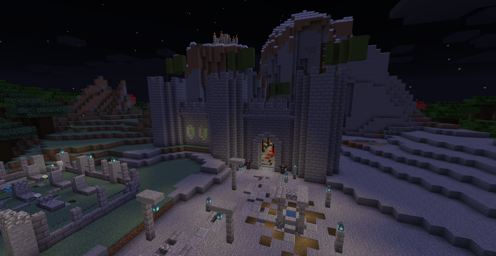
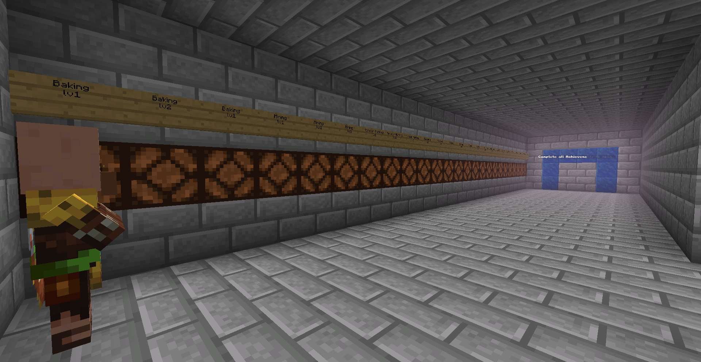
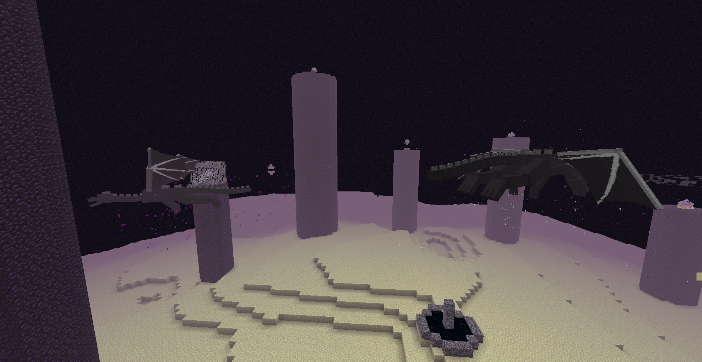
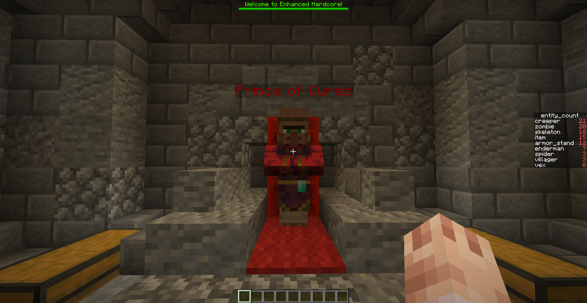
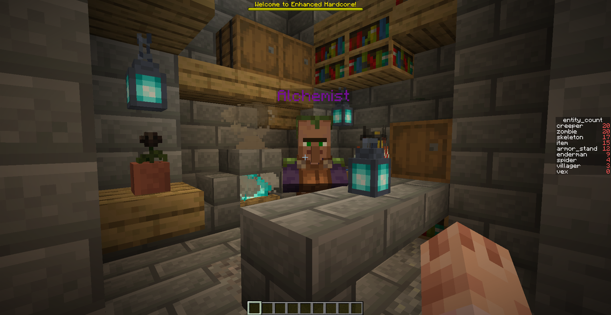
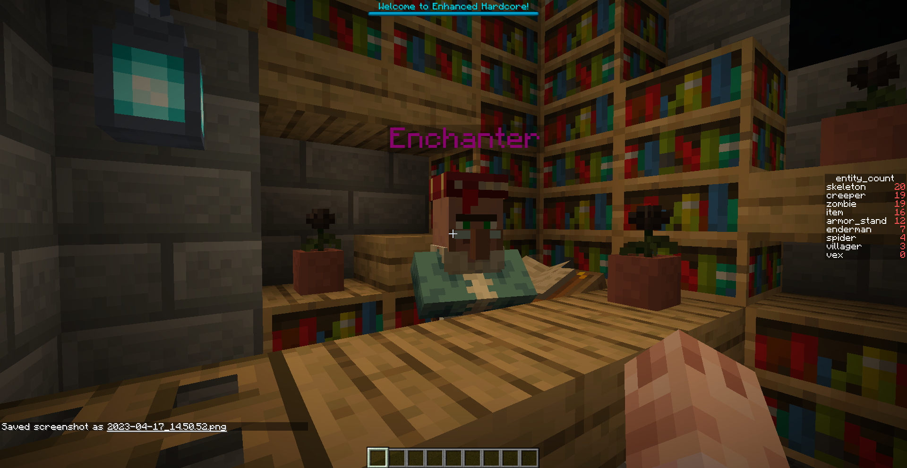
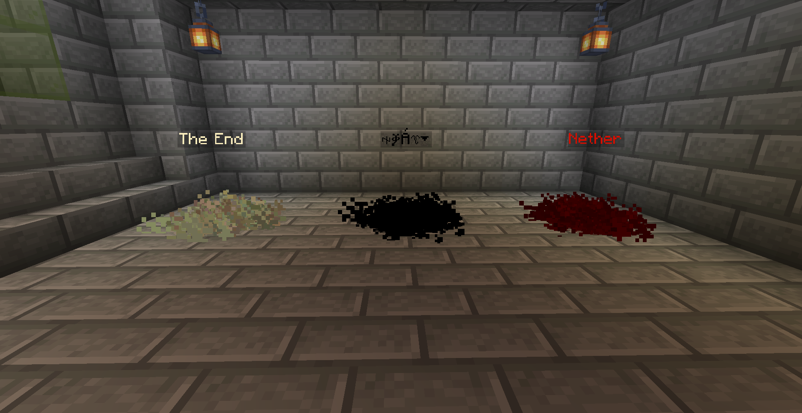
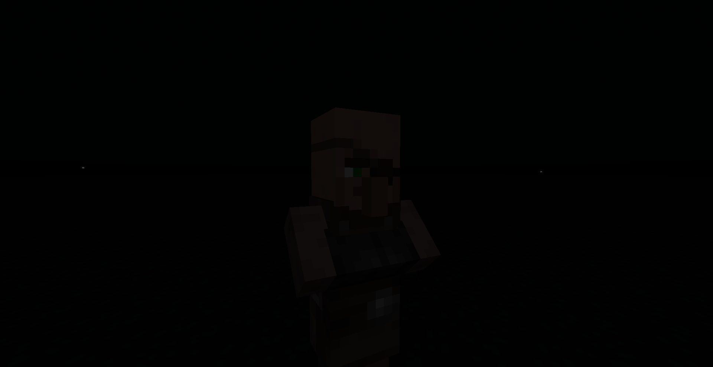

# Overview

Explore the world of Arcana before the great magical expansion (this is set before the story of Fantasia Arcana). This map is in hardcore mode; if players aren't revived (this is a mechanic), they die forever. If everyone dies the game ends! The map isn't complete, however it is playable and open for editing. The map is better played with an admin in creative mode doing roleplay and adding content and a group of players just doing regular survival. Enjoy!

  

# Class System

Everytime a player spawns into the world for the first time, they get assigned a role: 
- Miner: Spawns with a special pickaxe; 
- Sorcerer: Spawns with a begginer's spellbook and extra mana regeneration; 
- Fighter: Spawns with a special sword; 
- King: Spawns with a defense charm - when held, grants defense to the player; 
- Lumberjack: Spawns with a special axe; 
- Farmer: Spawns with a special hoe. 

# Affinity System

Everytime a player spawns into the world for the first time, they have a chance at getting an affinity:
- Moonlight affinity: Buffed during sunset; 
- Sunlight affinity: Buffed during sunrise; 
- Rain affinity: Buffed while it's raining; 
- Darkness affinity: Buffed when deep underground; 
- Day affinity: Slightly buffed during the day; 
- Night affinity: Slightly buffed during the night; 
- No affinity: The most common outcome. 

# Custom mobs

There are special custom mobs assigned to creepers, zombies and skeletons. Explore and find out!

# Blood essence

Killing mobs grants the player blood essence, useful for custom crafting

#Bonfire sacrifices

You can throw items on the hub bonfire to get potion effects.

# Progression system

In the *End Dimension* players can find a hallway that must be cleared up by progressing through the game - *proofs of progress*. 

  

After clearing the hallway the players get the chance of fighting against the final boss - Leonhard and Theodore.

  

# Sky Castle

A hidden location accessible through a cursed tome, sold by the Void Merchant. It's unfinished, and was planned to be a dungeon.

# The Prince of Cures, Alchemist, Enchanter and Void Merchant

These NPC's trade valuable items:  
The Prince of Cures sells items to cure ailments and *revive dead players - the arcane heart*.  

  

The Alchemist sells potions.  

  

The Enchanter sells spell books and other magical items.  

  

The Void Merchant, located in the *Void* (accessible in the hub), sells forbidden items.

  

  

