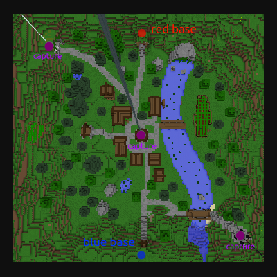
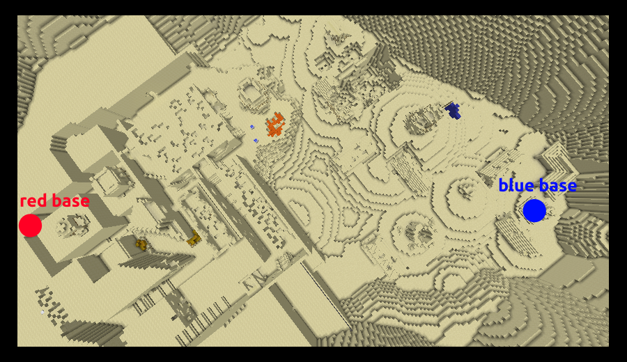
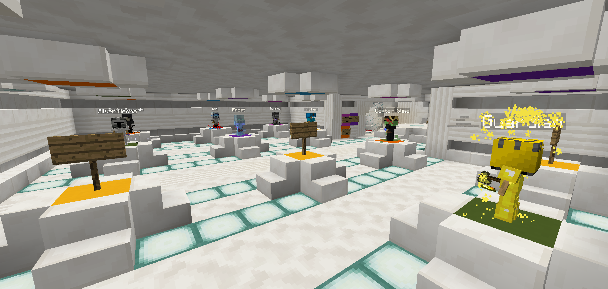

# Overview
`Minecraft PVP map for 1.12.2` (Very old and a bit unpolished, still fun to play with friends!)
Disclaimer: I am HXadow (one of my many names...)
This Map was made by me and Hexa ([LucasPatricio3](https://github.com/LucasPatricio3) on github, check him out!) as a fun project.
# Useful commands
Set the start score (decreases until zero -> game starts) \[glass doors are closed for START = 0\]:
```
/scoreboard players set START start X
```
Set the scores of a team (usually to force end a match):
```
/scoreboard players set RED SCORES 10000
```
# Gamemodes - Tower Capture
The tower capture gamemode consists of capturing three towers; Each time you capture your Team's score increases; kills also contribute to the score; upon capturing all points, your score starts steadily increasing, and the game ends at a score of 10000.
<p align="center">
  
</p>

# Gamemodes - Team Deathmatch
This gamemode consists in pure violence, rage and combat! The only objective is to kill enemies and reach 10000 score. The map is different:
<p align="center">
  
</p>

# Characters
The mechanics for the characters are all similar - pressing `Q` with an ability selected to use it (besides potions and GApple).
All the character information is documented in the character's handbook (to select a character simply go over the pod in the lobby)
<p align="center">
  
</p>

Here is a list of the characters:
* Raurus - The speed-poison demon
Passive - Running acceleration</br>
Poison Sword - Inflicts poison</br>
Poison Flask - Inflicts poison</br>
Speed Stone - Makes you reach Ludicrous speeds</br>
Golden apple - buffs and heals you, whilst paralysing nearby enemies</br>
* Archer - The ranger</br>
Passive - Archer's agility</br>
Bow - shoots arrows</br>
Shard - close range weapon</br>
Health Potion - heals you</br>
Wither Star - Reveals enemies and inflitcts withering</br>
* Ion - The healer</br>
Sword - Low damage</br>
Red - Heals nearby players and yourself</br>
Pink - Shields you from damage</br>
Purple - life-steal nearby enemies</br>
* Frost - The Ice Mage</br>
Axe - Deal damage</br>
Avalanche - Summon an avalanche that drags enemies</br>
Freeze - Freezes all enemies around you, preventing EVERYONE from dealing damage</br>
Ice Totem - Attacks players and makes them move slower</br>
* Shadow Assassin - The Master of Illusion</br>
Assassin's Sword - High damage dealing weapon</br>
Death Mark - teleport to nearby player and deal damage</br>
Shadow Clone - Summon a clone and teleport randomly to the highest point possible</br>
Death Sentence - 5 consecutive death marks</br>
* Silver Mecha - Warden of chains and warper of space</br>
Silver scythe - damage dealing</br>
Summon Fangs - summons a directional row of fangs</br>
Portal - places portal, use again to teleport and gain health</br>
Bound - teleport random enemy to you</br>
* Guardian - Protector of the realm</br>
Golden Axe - Deals damage</br>
Golden Minions - Summons 3 minions</br>
Overclock armour - Become invincible, but can't deal damage or move. Also heal a bit.</br>
Great Minion - Summon a giant minion</br>
* Captain Slime - The strategist</br>
Passive - Charge jumps with shift</br>
Knockback shovel - Deals immense knockback</br>
Slime landmines - Explode uppon contact</br>
Groundpound - Jump up and slam down dealing withering damage and stunning oponents into the air</br>
Reverser - Spawn a minion that shields you from attacks and converts minions to your team</br>

# Final note
Enjoy!
