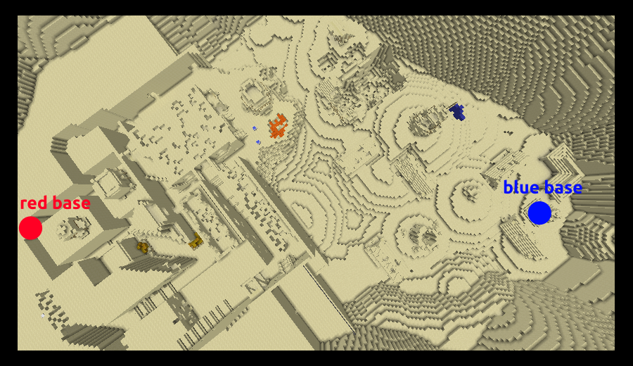

# Overview
`Minecraft PVP map for 1.12.2` (Very old and a bit unpolished, still fun to play with friends!)
Disclaimer: I am HXadow (one of my many names...)
This Map was made by me and Hexa (`LucasPatricio3` \[also known as Hexa\] on github, check him out!) as a fun project.
# Useful commands
Set the start score (decreases until zero -> game starts) \[glass doors are closed for START = 0\]:
```
/scoreboard players set START start X
```
Set the scores of a team (usually to force end a match):
```
/scoreboard players set RED SCORES 10000
```
# Gamemodes - Tower Capture
The tower capture gamemode consists of capturing three towers; Each time you capture your Team's score increases; kills also contribute to the score; upon capturing all points, your score starts steadily increasing, and the game ends at a score of 10000.
<p align="center">
  
</p>

# Gamemodes - Team Deathmatch
This gamemode consists in pure violence, rage and combat! The only objective is to kill enemies and reach 10000 score. The map is different:
<p align="center">
  
</p>

# Characters
The mechanics for the characters are all similar - pressing `Q` with an ability selected to use it (besides potions and GApple).
All the character information is documented in the character's handbook (to select a character simply go over the pod in the lobby)
<p align="center">
  
</p>

Here is a list of the characters:
* Raurus - The speed-poison demon
* Archer - The ranger
* Ion - The healer
* Frost - The Ice Mage
* Shadow Assassin - The Master of Illusion
* Silver Mecha - Warden of chains and warper of space
* Guardian - Protector of the realm
* Captain Slime - The strategist

# Final note
Enjoy!
